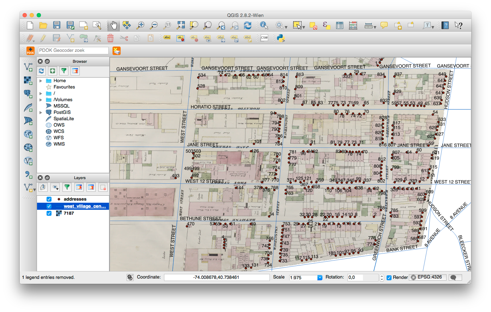
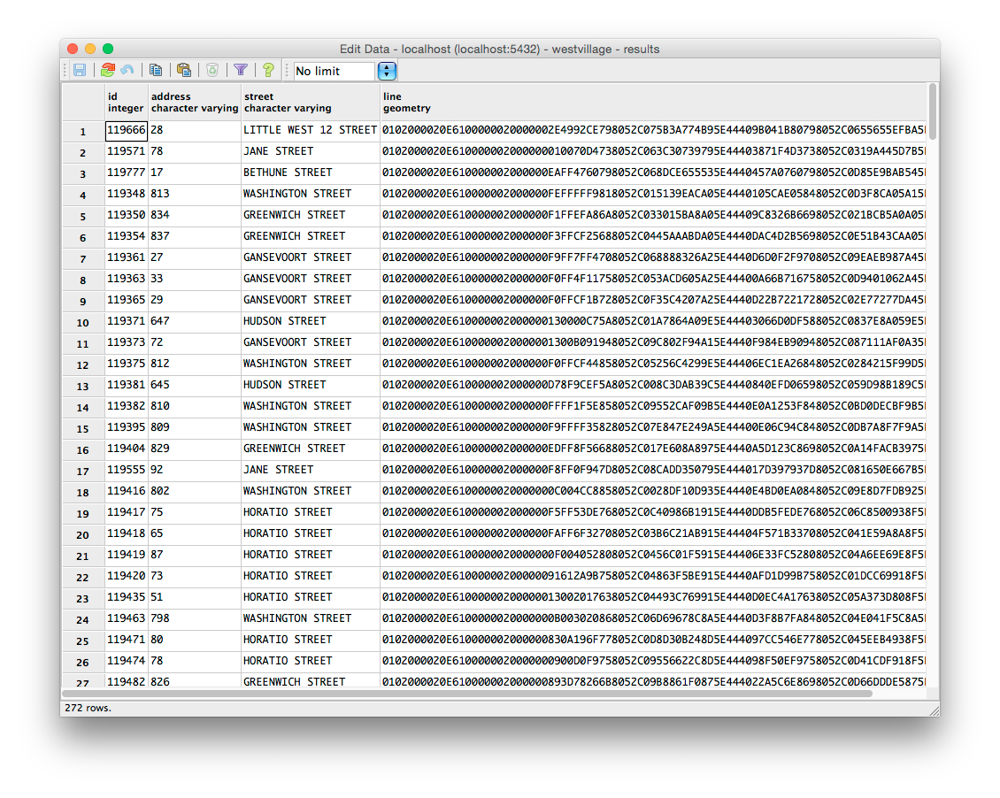
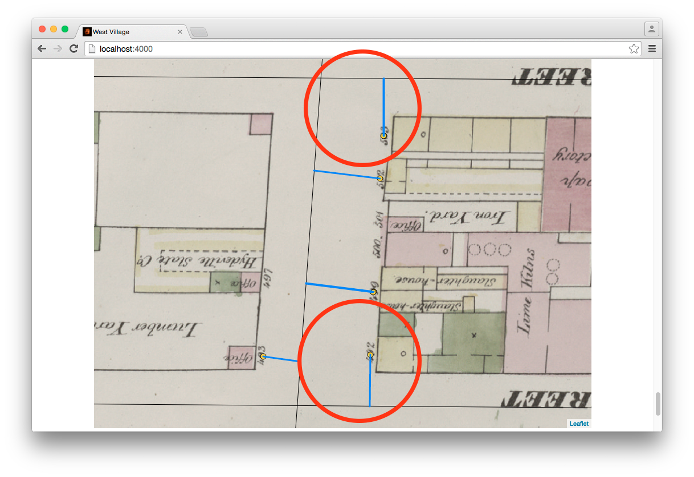

---
---

# West Village

Finding the closest street for a set of addresses seems like something PostGIS can easily do. Let's try!

It always helps to first view the files in QGIS, see where the streets and addresses are located, and think of an algorithm to link addresses to streets. To do this, we would need to convert `addresses.json` to something QGIS understands.

## Convert `addresses.json` to GeoJSON

[jq](http://stedolan.github.io/jq/)! jq is great! With jq it's easy to convert `addresses.json` to GeoJSON. The following Bash script converts `addresses.json` to `addresses.geojson`:

    #!/bin/bash

    read -r -d '' JQ << EOM
      {
        type: "FeatureCollection",
        features: [.[] | {
          type: "Feature",
          properties: {
            id: .id,
            address: .addresses[0].address
          },
          geometry: {
            type: "Point",
            coordinates: [
              .addresses[0].longitude,
              .addresses[0].latitude
            ]
          }
        }]
      }
    EOM

    cat ../data/addresses.json | jq "$JQ" > ../data/addresses.geojson

The resulting GeoJSON file:

## View data in QGIS

Now, let's use QGIS to have a look at the data! At first glance, it seems that for most addresses the closest street is indeed the correct street on which the address is located. A simple distance comparison might suffice for most addresses.

## Import into PostGIS

Now, we can import both GeoJSON files into PostGIS, using [ogr2ogr](http://www.gdal.org/ogr2ogr.html). First, create a new database (let's name this database `westvillage`), run `CREATE EXTENSION postgis`, and afterwards, run ogr2ogr twice:

    ogr2ogr -f PostgreSQL PG:"dbname=westvillage user=postgres password=postgres" \
        data/addresses.geojson -nln addresses
    ogr2ogr -f PostgreSQL PG:"dbname=westvillage user=postgres password=postgres" \
        data/west_village_centerlines.geojson -nln centerlines

## ST_Distance

With PostGIS's [ST_Distance function](http://postgis.refractions.net/docs/ST_Distance.html), it's easy to find the closest street center line for each address. By first converting each point to a PostGIS Geography, we'll ensure that the computed distances are in meters.

The following query will find the closest street from `centerlines` for each address from `addresses`:

    SELECT id, address, (
      SELECT street
      FROM centerlines cl
      ORDER BY ST_Distance(Geography(a.wkb_geometry), Geography(cl.wkb_geometry))
      LIMIT 1
    ) AS street
    FROM addresses a

ST_Distance does not use spatial indexes, this query will not perform too well on larger datasets. For larger datasets, we can rewrite the query to use the [`<->` operator](http://postgis.refractions.net/docs/geometry_distance_centroid.html), which _does_ use spatial indexes:

    SELECT id, address, (
      SELECT street
      FROM (
        SELECT *
        FROM centerlines cl1
        ORDER BY a.wkb_geometry <-> cl1.wkb_geometry
        LIMIT 5
      ) AS cl2
      ORDER BY ST_Distance(Geography(a.wkb_geometry), Geography(cl2.wkb_geometry))
      LIMIT 1
    ) AS street
    FROM addresses a

## Addresses and their closest streets

We can now use the SQL query from the previous section to create a new view containing each address, its closest street (and a line connecting the address and street, which makes visually checking the results very easy):

    CREATE VIEW results AS
    SELECT a.id, a.address, cl.street,
    ST_ShortestLine(a.wkb_geometry, cl.wkb_geometry) AS line
    FROM addresses a, centerlines cl, (
      SELECT ogc_fid AS a_fid, (
        SELECT ogc_fid
        FROM centerlines _cl
        ORDER BY ST_Distance(Geography(_a.wkb_geometry), Geography(_cl.wkb_geometry))
        LIMIT 1
      ) AS cl_fid
      FROM addresses _a
    ) AS a_cl
    WHERE a_cl.a_fid = a.ogc_fid AND a_cl.cl_fid = cl.ogc_fid

## Export view to GeoJSON file

With ogr2ogr, export the view to a GeoJSON file:

    ogr2ogr -f "GeoJSON" results/results.geojson \
        PG:"dbname=westvillage user=postgres password=postgres" results

The resulting GeoJSON file can be [downloaded from GitHub](https://github.com/bertspaan/west-village/blob/gh-pages/results/results.geojson), and is shown here:

## Combine everything!

The GitHub map above is not too useful for finding out whether the results are any good. We can use [Leaflet](http://leafletjs.com/) to view the three GeoJSON files (`addresses.geojson`, `west_village_centerlines.geojson` and `results.geojson`) on top of the West Village GeoTIFF file.

First, run [gdal2tiles](http://www.gdal.org/gdal2tiles.html) to convert `west_village.tif` to a set of tiles:

    gdal2tiles.py --profile=mercator -z 18-20 data/7187.tif tiles

And afterwards, create a simple Leaflet map, and load the GeoJSON files with D3.js:

    var map = L.map('map', {
      minZoom: 17,
      maxZoom: 20
    });

    L.tileLayer(baseUrl + '/tiles/{z}/{x}/{y}.png', {
      tms: true,
      maxZoom: 20,
      bounds: [
        [40.7352974, -74.0119905],
        [40.7418289, -74.0048389]
      ]
    }).addTo(map);

    map.setView([40.73795,-74.00790], 18);

    var addressStyle = {
      radius: 5,
      fillColor: "#ffd400",
      color: "#000",
      weight: 1,
      fillOpacity: 0.8
    };

    var streetStyle = {
      color: "#000",
      weight: 1
    };

    var geojsonLayers = [
      {
        url: 'data/addresses.geojson',
        options: {
          pointToLayer: function (feature, latlng) {
            return L.circleMarker(latlng, addressStyle);
          }
        }
      },
      {
        url: 'data/west_village_centerlines.geojson',
        options: {
          style: streetStyle
        }
      },
      {
        url: 'results/results.geojson',
        options: {}
      }
    ];

    geojsonLayers.forEach(function(layer) {
      d3.json(baseUrl + '/' + layer.url, function(json) {
        L.geoJson(json, layer.options).addTo(map);
      });
    });

## Finding errors

Although using only ST_Distance will find the correct street for almost all addresses, it's easy to spot addresses on the resulting map where the current naive approach will fint the wrong street. The image below shows to addresses on West Street for which an incorrect — although closest — street is found:

## Possible improvements

1. __Group addresses by house number similarity and distance__: addresses which are close together, both in distance and in the similarity of their house number are probably on the same street.
2. __Compare the angle of streets and groups of addresses__: most streets in New York (and all streets in West Village) are completely straight, and the addresses on a street should be on a line with approximately the same angle as the street itself.

## GitHub

See [GitHub](https://github.com/bertspaan/west-village) for the source code of this page, and all GeoJSON files.
